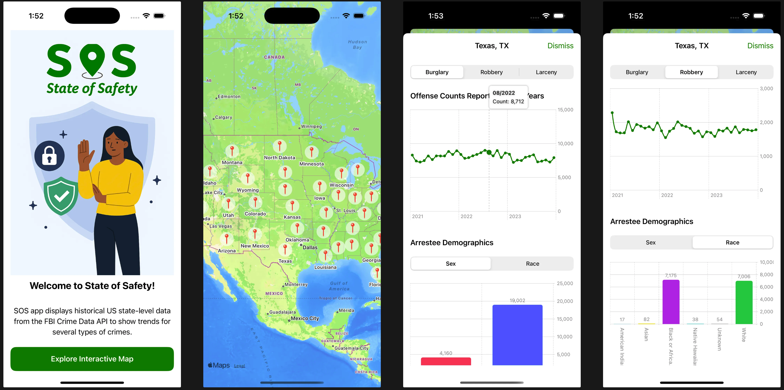

# State Of Safety

A SwiftUI app presents historical crime trends across US states using data from the FBI Crime Data API.

## Features
- View all US states on a map with pins for quick access to state-level data.
- Visualize trends for key crime categories like burglary, robbery, and larceny over the past 3 years with charts.

## Technologies
- SwiftUI 5
- MapKit
- Charts
- [FBI Crime Data API](https://cde.ucr.cjis.gov/LATEST/webapp/#/pages/docApi)
